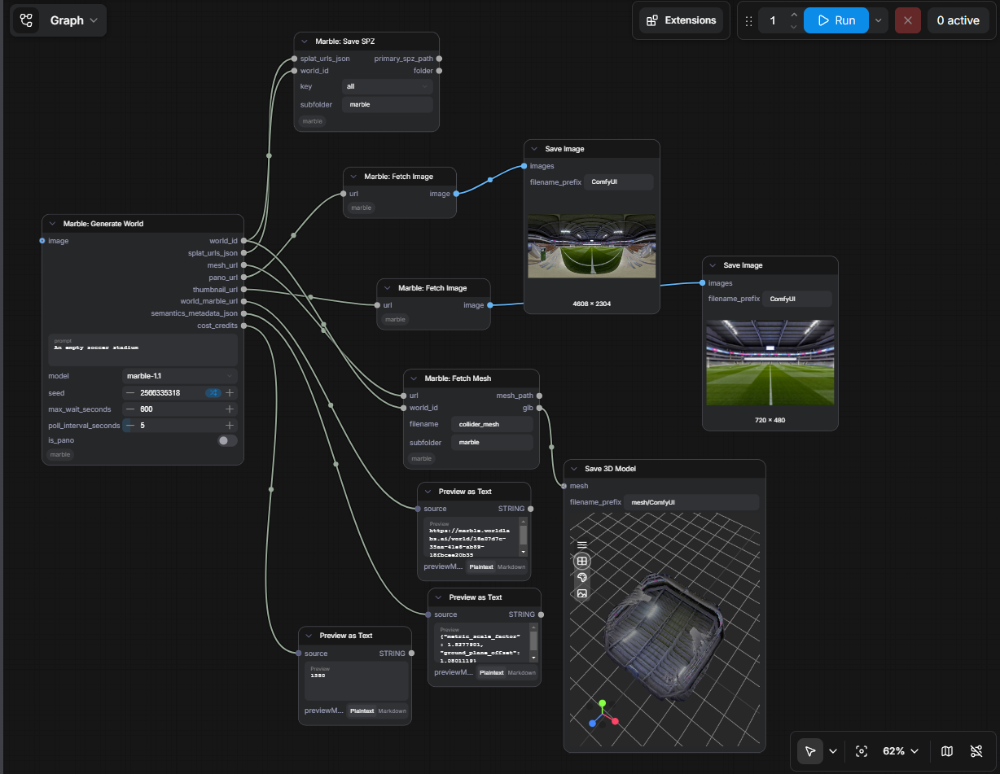

# ComfyUI Marble

> ⚠️ **Unreleased — work in progress.** This project is under active development, has not been released, and is subject to change. Nodes, inputs/outputs, and behaviour may change without notice.

ComfyUI custom nodes for [WorldLabs Marble](https://docs.worldlabs.ai/) — a 3D world generation API. Generate panoramas, Gaussian splats, and collider meshes from text or image prompts and pipe the assets straight into your ComfyUI workflow.



## Nodes

| Node | What it does |
|---|---|
| **Marble: Generate World** | Submits a text or image prompt, polls until ready, and returns asset URLs (pano, mesh, SPZ splats, thumbnail) plus generation metadata (cost, semantics). |
| **Marble: List Worlds** | Loads one of your already-generated worlds instead of generating a new one. Press **Update** to fetch your worlds into the dropdown, pick one by name, and it outputs the same fields as **Generate World** — so it's a drop-in source for the Fetch/Save nodes with no generation cost. |
| **Marble: Fetch Image** | Downloads a Marble image URL (pano or thumbnail) and outputs an `IMAGE`. Wires into Save Image, Preview Image, or any image-consuming node. |
| **Marble: Fetch Mesh** | Downloads the collider mesh (GLB) to disk. Outputs both a path string and a `FILE_3D_GLB` value compatible with **Save 3D Model**, **Preview 3D**, and other 3D-aware nodes. |
| **Marble: Fetch SPZ** | Downloads one Gaussian splat LOD (`full_res` / `500k` / `150k` / `100k`) into an in-memory `SPZ` value. Wire it into **Save SPZ** and/or **Convert SPZ to PLY** — nothing hits disk until one of those runs. |
| **Marble: Save SPZ** | Writes an `SPZ` value (from **Fetch SPZ**) to disk as a `.spz` file. |
| **Marble: Convert SPZ to PLY** | Converts an `SPZ` value (from **Fetch SPZ**) to a standard `.ply` (INRIA 3DGS layout) for use in other viewers and tools. Pure-Python decode — no extra dependencies. The `.ply` is roughly 10× larger than the `.spz`. |

All seven live under the **Marble** category in the node menu.

## Install

Via [ComfyUI-Manager](https://github.com/ltdrdata/ComfyUI-Manager): search for "ComfyUI Marble" and install.

Manual:

```bash
cd ComfyUI/custom_nodes
git clone https://github.com/rikturnbull/comfyui-worldlabs-marble.git
```

Then restart ComfyUI.

## API key

Get a key from [WorldLabs](https://docs.worldlabs.ai/). `Marble: Generate World` and `Marble: List Worlds` both resolve the key in this order:

1. **The `api_key` input on the node itself** — masked widget on `Marble: Generate World` and `Marble: List Worlds`. Convenient for one-off use.
   > ⚠️ The value is saved into the workflow JSON. The masking is display-only. Don't share, screenshot, or commit a workflow that has this filled in.
2. **`WORLDLABS_API_KEY` environment variable.** Set in your shell or system before launching ComfyUI Desktop. On Windows:
   ```powershell
   [Environment]::SetEnvironmentVariable("WORLDLABS_API_KEY", "wlt_...", "User")
   ```
3. **`marble_config.json` in the package root.** Useful when env vars don't propagate cleanly into ComfyUI Desktop:
   ```json
   {"api_key": "wlt_..."}
   ```
   This file is already in `.gitignore` — don't commit it.

The other Marble nodes (`Fetch Image`, `Fetch Mesh`, `Fetch SPZ`) don't need a key — they download from the CDN URLs that `Generate World` returns, which aren't authenticated. `Save SPZ` and `Convert SPZ to PLY` work entirely on the in-memory `SPZ` value, so they don't make network calls at all.

## Debug logging

HTTP request and response details can be logged to the ComfyUI Console for troubleshooting. Off by default. To enable:

```
WLT_DEBUG=1
```

When enabled, the API key (in headers) is never logged, and base64 image data is redacted to a length stub.

## Example workflow

```
Marble: Generate World ──pano_url───────────> Fetch Image ──IMAGE──> Save Image
                       ──thumbnail_url───────> Fetch Image ──IMAGE──> Preview Image
                       ──mesh_url
                         + world_id──────────> Fetch Mesh ──glb───> Save 3D Model
                       ──splat_urls_json
                         + world_id──────────> Fetch SPZ ──SPZ──┬──> Save SPZ
                                                                └──> Convert SPZ to PLY
```

`MarbleGenerateWorld` outputs everything as URLs (and `splat_urls_json` for the SPZ map) so each downstream node only does work for the assets you actually wire up.

`Marble: List Worlds` exposes the identical outputs, so you can swap it in wherever `Generate World` appears above to re-use an existing world instead of generating (and paying for) a new one.

## Viewing the converted PLY

The `.ply` from **Convert SPZ to PLY** is a standard 3D Gaussian Splatting file (INRIA `binary_little_endian` layout). It opens in any splat viewer, e.g. [SuperSplat](https://supersplat.playcanvas.com/) or [antimatter15/splat](https://antimatter15.com/splat/), both of which auto-frame the camera.

**Using ComfyUI-3D-Pack's "Preview 3DGS" node and getting a blank canvas** (with `RenderData`/`runSort … reading 'set' of undefined` in the browser console)? That's a 3D-Pack bug, not the PLY — `full_res` and the smaller LODs all work once it's fixed. Its viewer pins gsplat.js to `@latest`, and releases 1.2.5+ (July 2025) regressed. Pin a known-good version in `ComfyUI-3D-Pack/web/html/gsVisualizer.html`:
  ```diff
  - "gsplat": "https://cdn.jsdelivr.net/npm/gsplat@latest/dist/index.js"
  + "gsplat": "https://cdn.jsdelivr.net/npm/gsplat@1.2.4/dist/index.js"
  ```
  Then hard-reload ComfyUI with the browser cache disabled (DevTools → Network → "Disable cache" → Ctrl+R) so the iframe re-fetches the HTML. A 3D-Pack update may revert this; re-apply if needed.

## Development

```bash
git clone https://github.com/rikturnbull/comfyui-worldlabs-marble.git
cd comfyui-worldlabs-marble
python -m venv .venv
# Windows: .venv\Scripts\activate    macOS/Linux: source .venv/bin/activate
pip install -e ".[dev]"
pre-commit install
```

Run tests:

```bash
pytest tests/                  # fast, ~0.2s, no ComfyUI required
pytest tests/ --cov=src        # with coverage
```

The suite stubs every WorldLabs API call (via `responses`) and the ComfyUI runtime hooks (`folder_paths`, `comfy_api.latest.Types`), so it runs in any plain Python environment.

## CI

Workflows in [.github/workflows/](.github/workflows/):

- **[test.yml](.github/workflows/test.yml)** — pytest matrix (Python 3.10 / 3.11 / 3.12), 100% coverage gate, pre-commit (ruff lint + format).
- **[validate.yml](.github/workflows/validate.yml)** — Comfy Org's [node-diff](https://github.com/Comfy-Org/node-diff) for backwards-compat checks.
- **[check-marble-api.yml](.github/workflows/check-marble-api.yml)** — daily diff of the WorldLabs OpenAPI spec. On a change it opens a PR that already updates the stored snapshot and asks Copilot to make any matching `client.py` changes on the same branch (so the snapshot update lands even when no client change is needed).
- **[publish_node.yml](.github/workflows/publish_node.yml)** — publishes to the [Comfy Registry](https://registry.comfy.org) on tag push (requires `REGISTRY_ACCESS_TOKEN` repo secret).

## Releasing

Versions follow [SemVer](https://semver.org/). The changelog follows [Keep a Changelog](https://keepachangelog.com/) and lives in [CHANGELOG.md](CHANGELOG.md).

**During development:** add bullets under `## [Unreleased]` in `CHANGELOG.md`, grouped under `### Added` / `### Changed` / `### Fixed` / `### Removed`.

**On release day:**

```bash
bump-my-version bump <major|minor|patch>   # bumps version + dates the CHANGELOG section + commits + tags
git push && git push --tags                # tag push triggers publish_node.yml → Comfy Registry
gh release create vX.Y.Z --notes-from-tag  # public GitHub Release
```

The `bump-my-version` step:
- Updates `version` in `pyproject.toml` and `__version__` in `__init__.py`.
- Inserts a dated `## [X.Y.Z] - YYYY-MM-DD` heading above the existing entries in `CHANGELOG.md`, leaving `## [Unreleased]` empty for the next cycle.
- Creates a commit `Release vX.Y.Z` and an annotated tag `vX.Y.Z`.

The Comfy Registry publish requires `REGISTRY_ACCESS_TOKEN` set as a GitHub repository secret.

## License

MIT — see [LICENSE](LICENSE).
